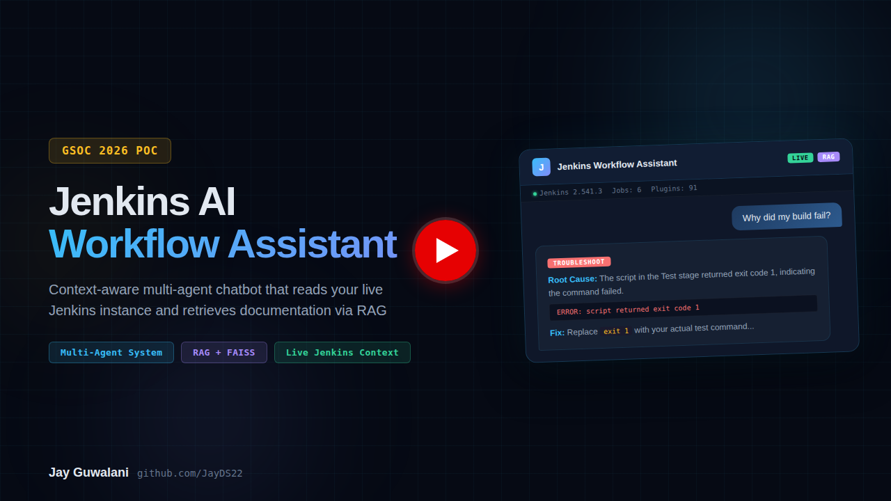
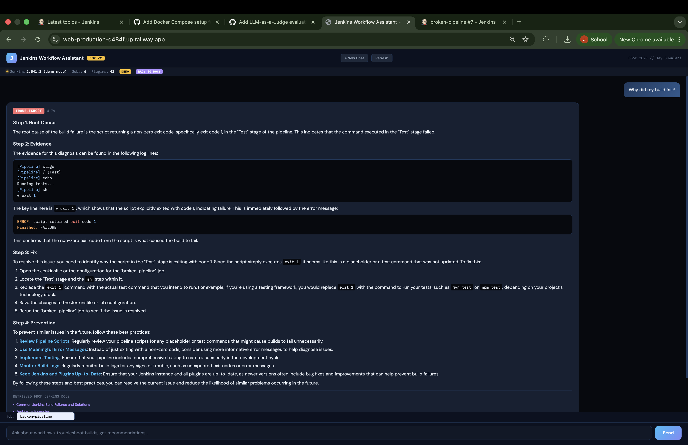
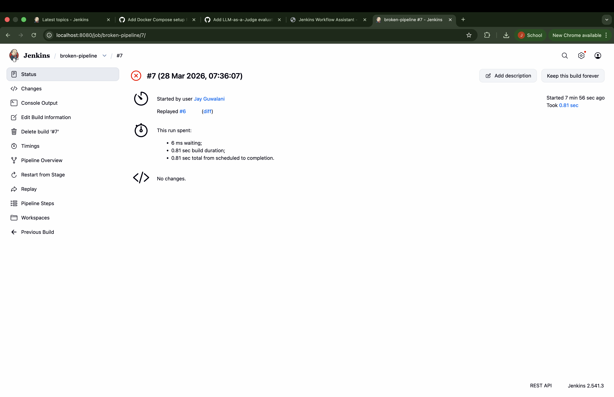
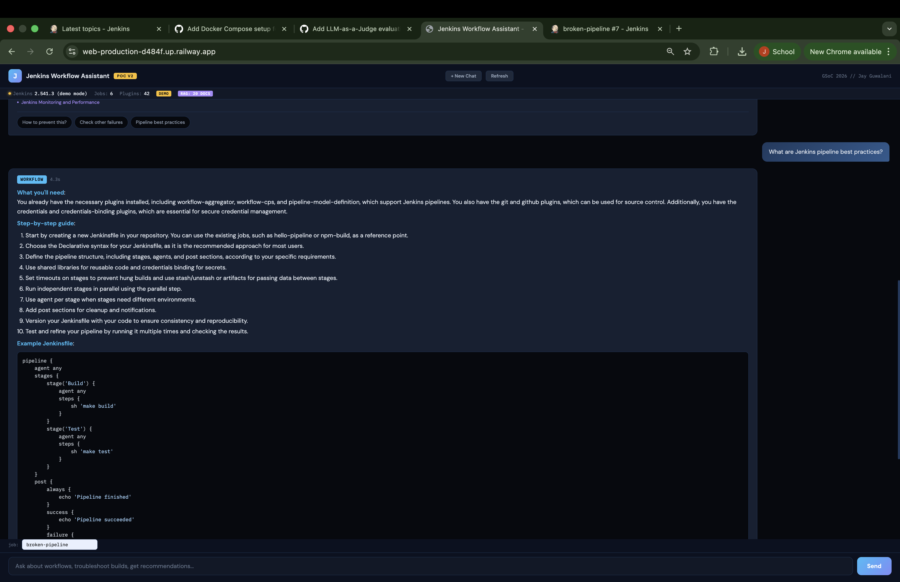
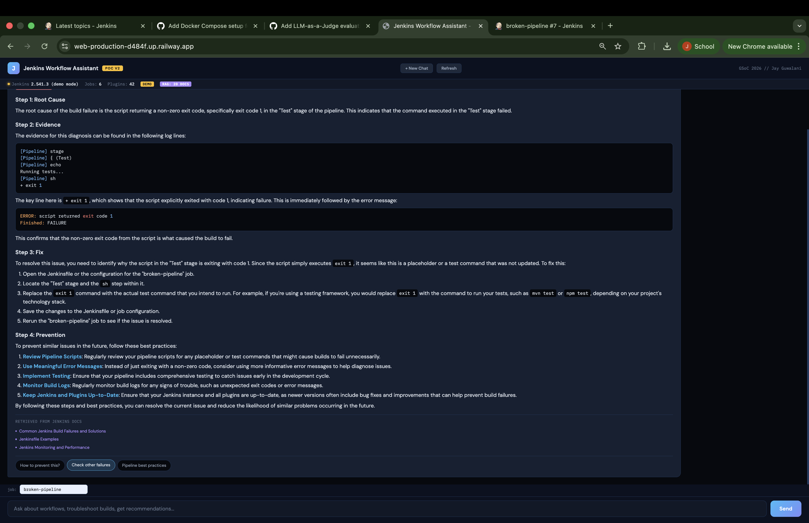
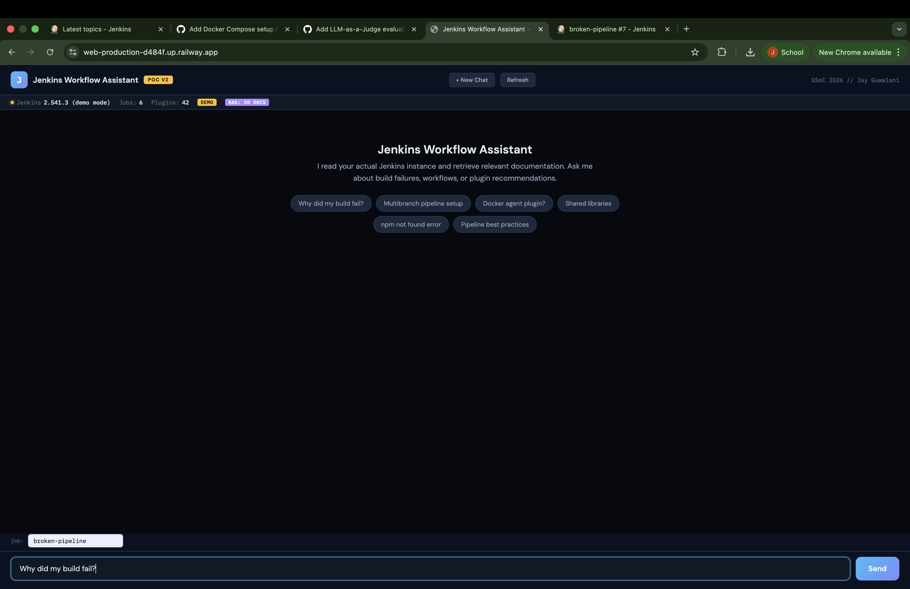
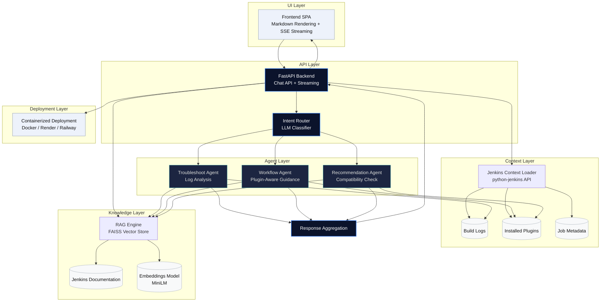

# Jenkins Workflow Assistant - GSoC 2026 PoC

A context-aware, multi-agent AI chatbot that reads your **live Jenkins instance**, retrieves relevant documentation via **RAG (FAISS + embeddings)**, and provides intelligent workflow guidance, build troubleshooting, and plugin recommendations.

**Built by [Jay Guwalani](https://github.com/JayDS22)** as a proof-of-concept for the [AI Chatbot to Guide User Workflow](https://www.jenkins.io/projects/gsoc/2026/project-ideas/ai-chatbot-to-guide-user-workflow/) GSoC 2026 project.


[](https://youtu.be/Wbwm0EWpu28)| **[Live Demo](https://web-production-d484f.up.railway.app/)** | **[GitHub Repo](https://github.com/JayDS22/jenkins-workflow-chatbot)**

---

## What Makes This Different

Most Jenkins AI chatbots answer generic questions from documentation. This one **reads your actual Jenkins state** AND retrieves relevant docs, giving you answers specific to your setup.

## Screenshots

### Troubleshoot agent diagnosing a real build failure


<details>
<summary>🖼️ <b>More screenshots (click to expand)</b></summary>

#### Live Jenkins instance with failed build


#### Context-aware workflow guidance with Jenkinsfile example  


#### RAG sources cited from Jenkins documentation


#### Deployed on Railway (shareable URL)


</details>

| Feature | Generic Chatbot | This PoC |
|---------|----------------|----------|
| "Why did my build fail?" | Generic debugging tips | Reads your actual build log, extracts error lines, gives a targeted fix |
| "How do I set up X?" | Copy-paste from docs | Checks your installed plugins first, tells you what's missing vs already installed |
| "What plugin should I use?" | Lists popular plugins | Cross-references your existing plugins for compatibility |
| Documentation retrieval | Static doc search | RAG with FAISS vector store + sentence-transformers embeddings |
| Intent routing | Single prompt for everything | Multi-agent system with specialized agents (troubleshoot / workflow / recommend) |
| Without Jenkins | Doesn't work | Full demo mode with realistic mock build logs, errors, and plugin data |


## Architecture

A context-aware, multi-agent system that combines **live Jenkins state** with **retrieval-augmented generation (RAG)** to deliver precise, instance-specific guidance.

### High-Level System Design



**Tech Stack:**
- **Backend**: FastAPI + python-jenkins + LangChain
- **LLM**: Llama 3 70B via Groq (free tier, fast inference, no GPU)
- **RAG**: FAISS + sentence-transformers (all-MiniLM-L6-v2, 80MB, CPU-only)
- **Frontend**: Vanilla HTML/CSS/JS + marked.js + highlight.js (no build step)
- **Streaming**: SSE (Server-Sent Events) with intent/context/RAG/response events
- **Deployment**: Docker, Render, Railway, Fly.io (single container, one URL)

## Quick Start

### Option 1: Local (5 minutes)

```bash
git clone https://github.com/JayDS22/jenkins-workflow-chatbot.git
cd jenkins-workflow-chatbot
python -m venv venv && source venv/bin/activate
pip install -r requirements.txt
cp .env.example .env   # Add your Groq API key
uvicorn app.main:app --reload --port 8000
```

Open http://localhost:8000 - works immediately in demo mode, no Jenkins needed.

### Option 2: With Live Jenkins

```bash
# Start Jenkins (if you don't already have one)
docker run -p 8080:8080 jenkins/jenkins:lts

# Get your API token: Jenkins > User > Configure > API Token
# Add to .env: JENKINS_URL, JENKINS_USER, JENKINS_TOKEN

# Create demo jobs
chmod +x scripts/create_test_jobs.sh
JENKINS_USER=admin JENKINS_TOKEN=your_token ./scripts/create_test_jobs.sh

# Start the chatbot
uvicorn app.main:app --reload --port 8000
```

### Option 3: Deploy to Cloud (shareable URL)

**Render (free):**
1. Push to GitHub
2. Connect repo at [render.com](https://render.com)
3. Set `GROQ_API_KEY` in environment variables
4. Deploy - runs in demo mode with a public URL

**Docker:**
```bash
docker build -t jenkins-chatbot .
docker run -p 8000:8000 -e GROQ_API_KEY=your_key jenkins-chatbot
```

## Demo Queries

| Query | Agent | What Happens |
|-------|-------|-------------|
| "Why did my build fail?" (job: broken-pipeline) | TROUBLESHOOT | Reads actual build log, extracts `exit 1` error, gives targeted fix |
| "My npm build is failing" (job: npm-build) | TROUBLESHOOT | Finds `npm: not found`, recommends NodeJS plugin or Docker agent |
| "How do I set up a multibranch pipeline?" | WORKFLOW | Checks installed plugins, gives customized steps with Jenkinsfile example |
| "What plugin for Docker-based agents?" | RECOMMEND | Cross-references your plugins, checks version compatibility |
| "How do I use shared libraries?" | GENERAL + RAG | Retrieves shared libraries doc, gives practical answer |
| "Jenkins pipeline best practices" | GENERAL + RAG | Retrieves best practices doc, summarizes key points |


## Key Features

### Context-Aware Agents
Each agent receives live Jenkins state (or realistic mock data). The troubleshoot agent gets actual build logs with extracted error lines. The workflow agent knows which plugins you already have. The recommend agent checks compatibility.

### RAG (Retrieval Augmented Generation)
20 curated Jenkins documentation chunks indexed in FAISS with sentence-transformer embeddings. Agents receive the top-3 most relevant docs alongside live context. The `/api/rag/search?q=your+query` endpoint lets you test retrieval directly.

### Demo Mode
When Jenkins isn't connected, the system uses realistic mock data: actual build log output, real error messages (npm not found, Docker build failures, test timeouts), and a realistic plugin list. Reviewers can evaluate the full system without Docker.

### SSE Streaming
The streaming endpoint sends events progressively: intent classification first (instant feedback), then Jenkins context, then RAG sources, then the full response. The frontend shows the intent tag immediately while the LLM generates.

### Markdown Rendering + Syntax Highlighting
Responses render as proper markdown with syntax-highlighted code blocks (Groovy, Bash, YAML). Makes Jenkinsfile examples actually readable.

## Project Structure

```
jenkins-workflow-chatbot/
|-- app/
|   |-- main.py                       # FastAPI app with RAG + demo mode
|   |-- agents/
|   |   |-- router.py                 # LLM intent classifier
|   |   |-- troubleshoot.py           # Build failure diagnosis
|   |   |-- workflow.py               # Step-by-step guidance
|   |   |-- recommend.py              # Plugin recommendations
|   |-- rag/
|   |   |-- engine.py                 # FAISS + sentence-transformers
|   |-- demo/
|   |   |-- mock_data.py              # Realistic mock build logs
|   |-- data/jenkins_docs/
|   |   |-- corpus.json               # 20 Jenkins doc chunks
|   |-- utils/
|       |-- jenkins_context.py        # Live Jenkins state reader
|-- frontend/
|   |-- index.html                    # Chat UI (markdown, syntax highlight, RAG citations)
|-- scripts/
|   |-- create_test_jobs.sh           # Creates demo jobs in Jenkins
|   |-- test_endpoints.sh             # API smoke tests
|-- tests/
|-- Dockerfile                        # Cloud deployment
|-- render.yaml                       # Render.com config
|-- railway.toml                      # Railway config
|-- Procfile                          # Heroku/Railway
|-- requirements.txt
|-- .env.example
```

## API Endpoints

| Method | Endpoint | Description |
|--------|----------|-------------|
| GET | `/` | Frontend UI |
| GET | `/api/health` | Health check + RAG status |
| GET | `/api/jenkins/info` | Jenkins server state (live or demo) |
| GET | `/api/jenkins/failed` | All recent build failures |
| GET | `/api/jenkins/jobs/{name}` | Job details |
| GET | `/api/rag/search?q=query` | Test RAG retrieval directly |
| POST | `/api/chat` | Main chat (returns JSON) |
| POST | `/api/chat/stream` | SSE streaming chat |
| GET | `/docs` | Auto-generated OpenAPI docs |

## GSoC 2026 Roadmap

| Phase | Deliverable | Status |
|-------|-------------|--------|
| **Application** | This PoC: context-aware multi-agent + RAG + demo mode | Done |
| **Community Bonding** | Mentor feedback integration + plugin UI research | Planned |
| **Month 1** | Jenkins plugin sidebar integration + contextual inline hints | Planned |
| **Month 2** | Full RAG pipeline over Jenkins docs, plugin directory, Discourse | Planned |
| **Month 2** | Build failure diff analysis (last success vs current failure) | Planned |
| **Month 3** | Persistent chat sessions + conversation history | Planned |
| **Month 3** | Evaluation framework (LLM-as-a-judge for response quality) | Planned |
| **Stretch** | Voice interaction + multi-language support | Planned |

## Why This Architecture

**Context-awareness + RAG**: The existing resources-ai-chatbot-plugin does RAG over docs. This PoC adds what's missing: live Jenkins state injection. The production version combines both - RAG for documentation knowledge, context injection for instance-specific answers.

**Multi-agent routing**: Different problems need different treatment. A build failure needs log analysis with error extraction. A "how do I" question needs workflow guidance with plugin awareness. A plugin question needs compatibility checking. One prompt cannot do all three well. This mirrors the 5+ agent system I built at Aya Healthcare (2000+ concurrent users, P95 <180ms).

**Demo mode**: Reviewers must be able to run the code without setting up Jenkins. The mock data isn't toy data - it's real Jenkins console output, real error messages, and a realistic plugin list. The agents produce compelling responses even on mock data.

**Single-port deployment**: Frontend served by FastAPI on the same port. One container, one URL, works on any cloud platform. No separate frontend deployment, no CORS issues in production.

## What This PoC Proves

1. **Understanding the actual problem.** Not "answer questions about docs" but "understand what the user is doing in Jenkins and help them."

2. **Multi-agent system design.** Intent router + 3 specialized agents, same production pattern from Aya Healthcare (5+ agents, LangGraph, 2000+ concurrent users).

3. **Context-awareness works.** The chatbot reads real Jenkins state. When it says "you already have the git plugin installed", it checked your actual instance.

4. **RAG integration.** FAISS vector store with sentence-transformer embeddings over Jenkins docs. Agents get relevant documentation alongside live context.

5. **Production-ready demo.** Works without Jenkins (demo mode), deploys to cloud (Render/Railway), serves frontend on same port, proper error handling.

6. **Ships fast.** Full working demo with frontend, backend, multi-agent routing, RAG, live Jenkins integration, demo mode, cloud deployment, and documentation.

---

**Author**: Jay Guwalani | [GitHub](https://github.com/JayDS22) | [LinkedIn](https://linkedin.com/in/j-guwalani) | jguwalan@umd.edu
